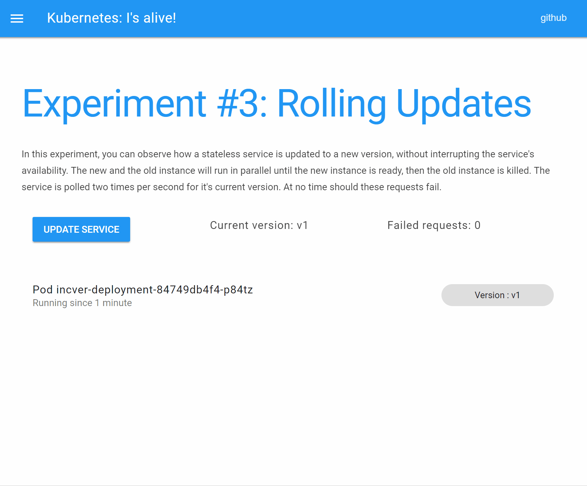
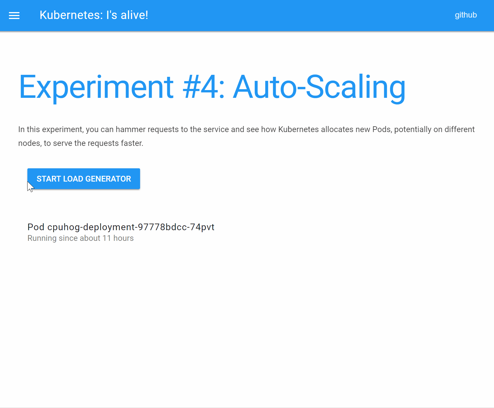

[](https://travis-ci.org/daniel-kun/kube-alive)

# Kubernetes: It's alive!

You can find a dashboard with experiments with Kubernetes (k8s) to observe it's behaviour in real scenarios in this project.
You should have a k8s cluster up and running to deploy the tools from this repository.

## Tested platforms

kube-alive is tested on the following platforms, with Kubernetes version 1.8 and 1.9:

- Minikube (see [official guide](https://kubernetes.io/docs/getting-started-guides/minikube/))
- Microsoft Azure Container Service AKS (see [official guide](https://docs.microsoft.com/en-us/azure/aks/intro-kubernetes#using-azure-container-service-aks))
- Google Kubernetes Engine GKE (see [official guide](https://cloud.google.com/kubernetes-engine/docs/quickstart))
- Bare metal arm32v7-cluster based on Raspberry Pi 3 (see [a guide by Scott Hanselman](https://www.hanselman.com/blog/HowToBuildAKubernetesClusterWithARMRaspberryPiThenRunNETCoreOnOpenFaas.aspx))
- Bare metal arm64v8-cluster on https://www.packet.net/ (Type 2A on location EWR1 - thanks to [packet.net](https://www.packet.net/) for sponsoring hardware to help port kube-alive)

## Deployment

*Prerequisites:*
* You need to have `kubectl` installed and configured to point at a running cluster that you have admin access to.
* If you are running on Google Kubernetes Engine, your default account does not have the privilege to grant more privileges. To circumvent this, you can grant yourself cluster-admin rights: `kubectl create clusterrolebinding root-cluster-admin-binding --clusterrole=cluster-admin --user=<your-google-mail-address>`

You can deploy kube-alive to your local cluster with this single command:

```bash
curl -sSL https://raw.githubusercontent.com/daniel-kun/kube-alive/master/deploy.sh | bash
```

This will install the required resources into the `kube-alive` Kubernetes namespace.

# Experiments

Behaviours of k8s that can be observed "live":


---


---



---



