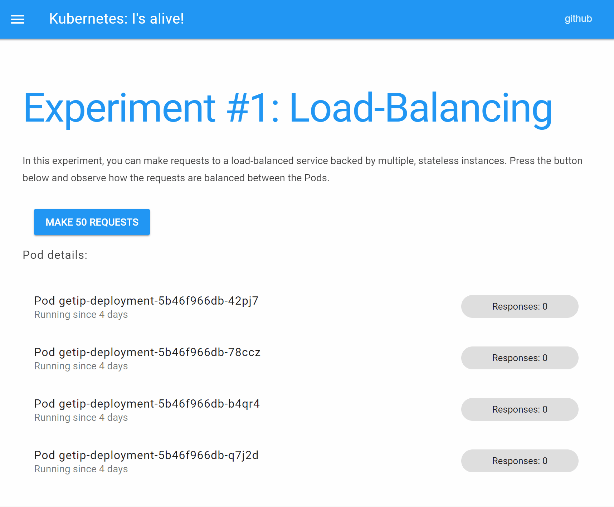
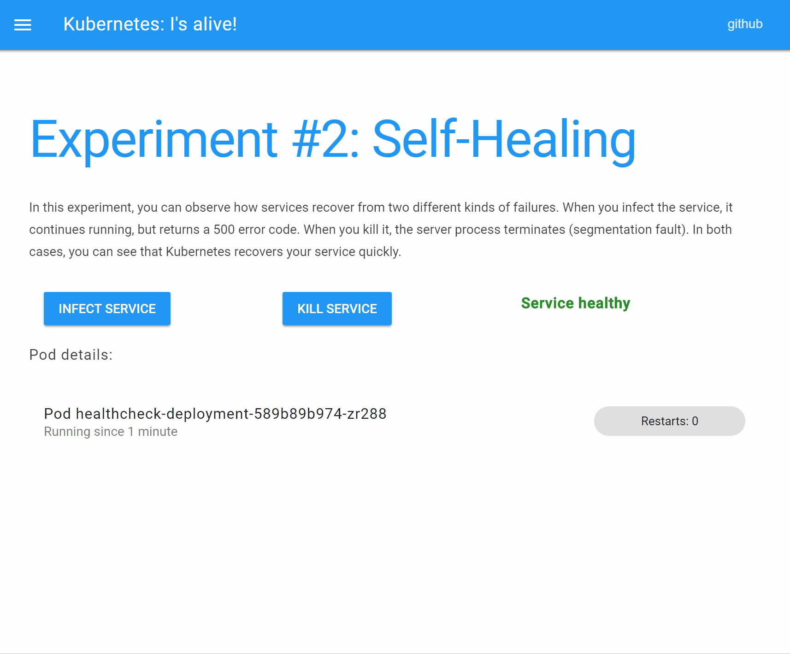

# Kubernetes: It's alive!

You can find a dashboard with experiment with Kubernetes (k8s) to observe it's behaviour in real scenarios in this project.
You should have a k8s cluster up and running on ARM to deploy the tools from this repository.
I used a Raspberry Pi cluster with five nodes and set them up as described by Scott Hanselman here: https://www.hanselman.com/blog/HowToBuildAKubernetesClusterWithARMRaspberryPiThenRunNETCoreOnOpenFaas.aspx

*Disclaimer: Some configs I made in this rep are highly UNSECURE, e.g. I expose the https, authenticated API call to kubernetes as non-secure HTTP without authentication via nginx.
This also is early work in progress, the configs include hard-coded IP addresses of the master node and the required local Docker registry must be set up manually.
In a few weeks, I should be able to provide ready-to-use k8s config files and containers on docker hub so you can install this in a single command and see k8s behaviour in real-time.*

Behaviours of k8s that can be observed "live":

## Load-Balancing
When a ReplicaSet with multiple Pods exists, see how results are served from different Pods via Kubernete's load balancing. Each Pod returns it's IP address and the Frontend shows you how many of your requests have been made by which Pod.
(see src/getip or http://\<ip-of-master\>:80)

## Self-Healing
When an app crashes or becomes unhealthy (via health-check), see how the Pod is restarted and becomes healthy again.
(see src/healthcheck or http://\<ip-of-master\>:81)

## Auto-Scale
When traffic can not be served with a single Pod and CPU usage exceeds 50%, more Pods are created automatically and more requests are served.
(see src/cpuhog or http://\<ip-of-master\>:84)

## Deployment
When a deployment is updated, you see that new Pods are created and then old Pods are killed. (coming soon)

